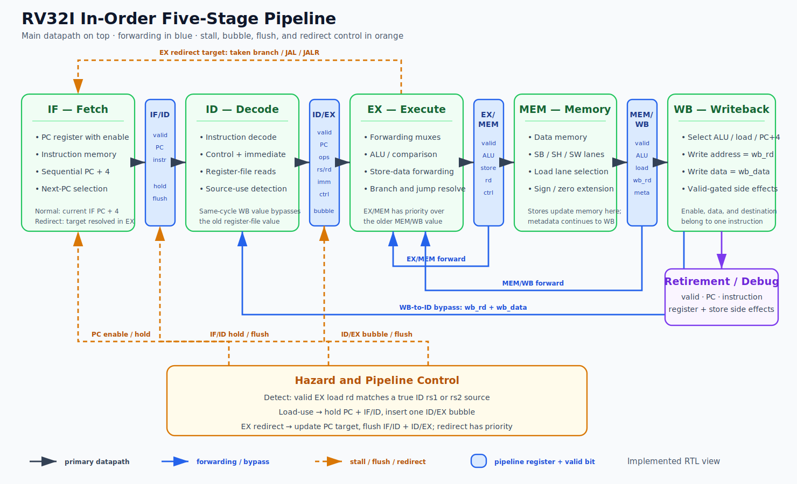

# RV32I Pipeline Block Diagram

The diagram below represents the implemented five-stage pipeline, including forwarding, WB-to-ID bypass, load-use stalling, EX-stage redirects, pipeline flushing, and coherent WB retirement.

See [MICRO_ARCH.md](MICRO_ARCH.md) for the detailed timing and control rules.
